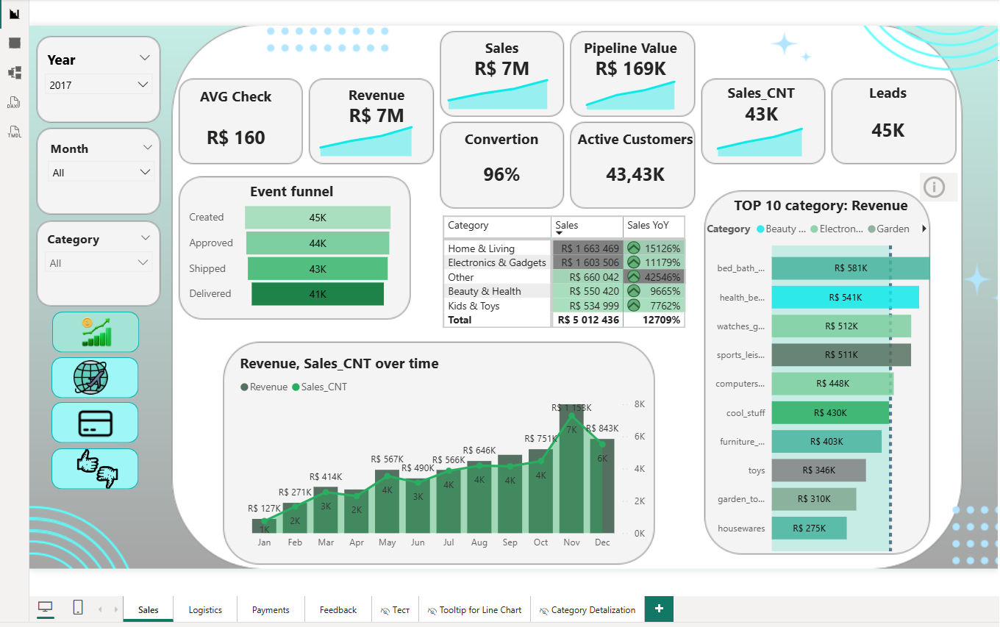
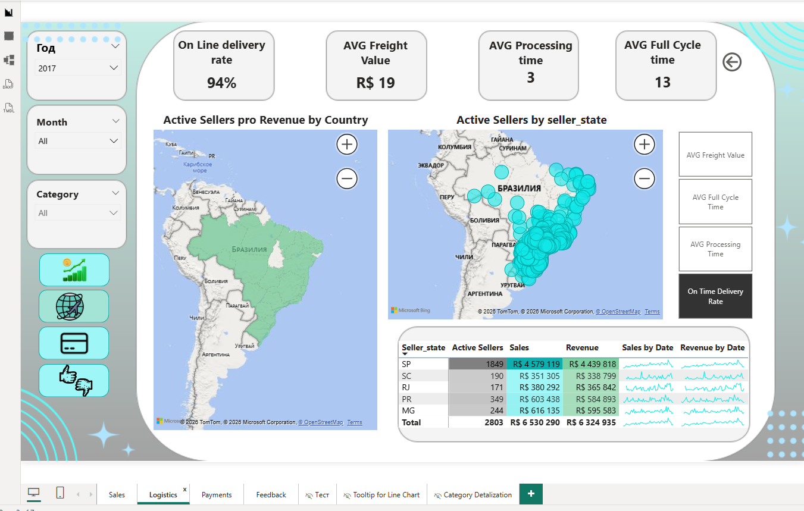
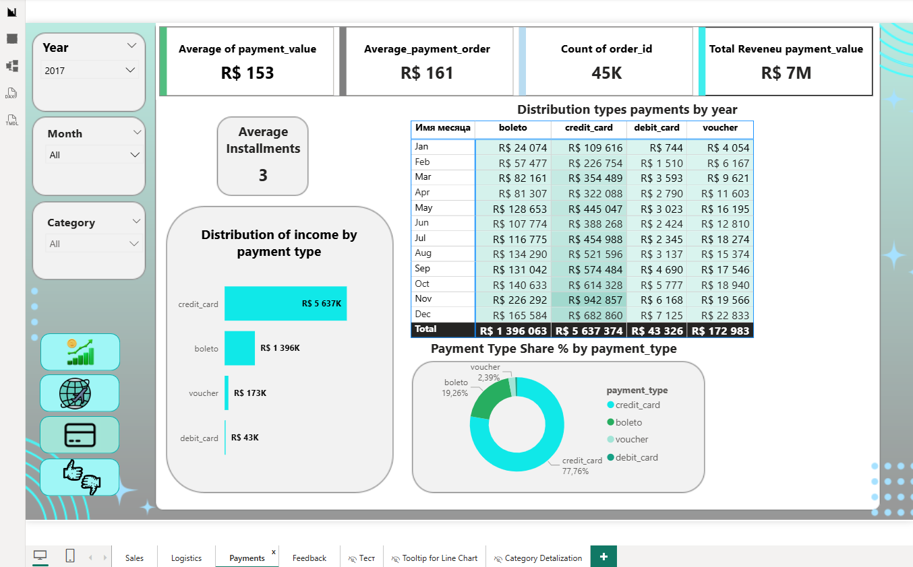
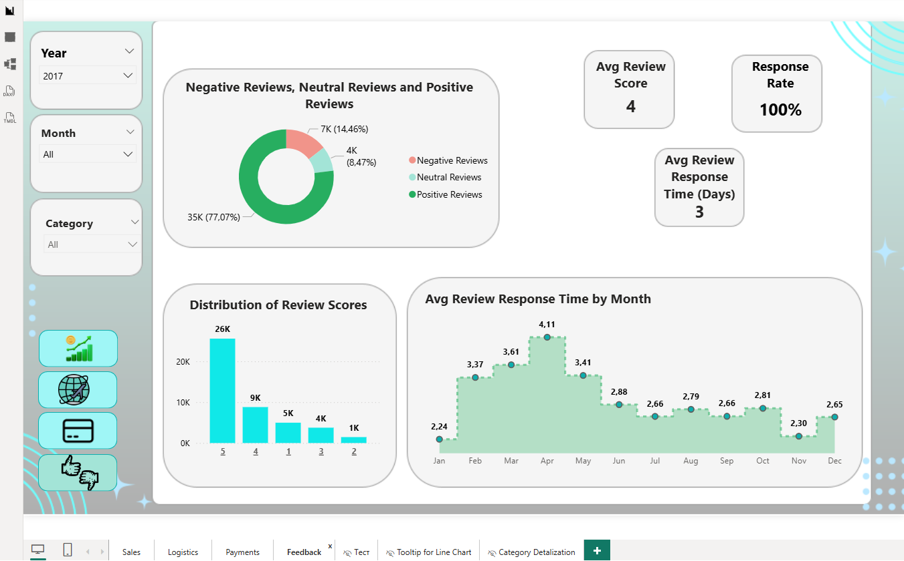

# 📊 E-Commerce Analytics — Power BI Dashboard (Olist)

An interactive **Power BI dashboard suite** built on the **Olist Brazilian E-Commerce dataset**, turning ~100k raw transactional records into an executive-ready analytics product across **Sales, Logistics, Payments and Customer Feedback**.

> Built in Power BI Desktop · star-schema data model · 27 DAX measures · time intelligence (YoY) · drill-through · custom tooltips · measure switcher.

---

## 🧭 Overview

The goal was to transform disconnected Olist transaction tables into a single, navigable analytics system that answers real business questions:

- How is **revenue** trending, and how does it compare **year over year**?
- Where are the **drop-offs** in the order funnel?
- How **fast and reliable** is delivery, and where geographically does it break down?
- Which **payment methods** dominate, and how do installments affect order value?
- What drives **customer satisfaction**, and how does delivery time relate to review scores?

Four interconnected report pages share a consistent layout and navigation system so a stakeholder can move from a high-level KPI to a single product category without losing context.

---

## 🖼️ Dashboard Preview

> _Screenshots — export one PNG per page from Power BI Desktop into `/screenshots` (see `screenshots/README.md`)._

| Sales | Logistics |
|-------|-----------|
|  |  |

| Payments | Feedback |
|----------|----------|
|  |  |

---

## 📑 Report Pages

### 1. 📈 Sales
Revenue and order performance with full time intelligence.
- KPI cards: **Revenue, Sales, AVG Check, Active Customers**
- **Year-over-year** trend (Sales, Sales Prev Year, Sales YoY) on an area / combo chart
- **Order funnel** (Leads → Conversion) and pipeline value
- Category performance with a **measure switcher** to flip the same visual between metrics
- Drill-through into **Category Detalization** for sub-category profitability

### 2. 🚚 Logistics
Delivery speed and reliability, mapped geographically.
- **On-time delivery rate**, **AVG Full Cycle Time**, **AVG Processing Time**, **AVG Freight Value**
- **Filled map + bubble map** of sellers / delivery performance by state
- Active sellers and regional fulfillment breakdown

### 3. 💳 Payments
Payment behaviour and transaction structure.
- **Payment Type Share %** (donut) and value by method (bar)
- **Average Installments** and **Average payment per order**
- Monthly payment trend

### 4. ⭐ Feedback
Customer satisfaction and its drivers.
- **Avg Review Score**, **Positive / Neutral / Negative Reviews**
- **Response Rate %** and **Avg Review Response Time (Days)**
- Review-score distribution and its relationship to delivery time

**Helper pages:** a **custom tooltip page** (donut breakdown on hover) and a **drill-through detail page** (Category Detalization) keep the main pages clean while preserving depth.

---

## 🧱 Data Model

A classic **star schema** built and cleaned in **Power Query**:

**Fact tables**
- `olist_orders_dataset` · `olist_order_items_dataset` · `olist_order_payments_dataset` · `olist_order_reviews_dataset`

**Dimensions**
- `olist_customers_dataset` · `olist_products_dataset` · `olist_sellers_dataset` · `Order Stages`

**Supporting**
- `Calendar` — dedicated date table for time intelligence
- `DAX_Measures`, `Measures_Sales`, `Measures_AVG`, `Measures_Reviews`, `For Switcher` — measures organized into dedicated tables for maintainability

---

## 🧮 Key DAX Measures

**Sales & time intelligence:** `Revenue` · `Sales` · `Sales Prev Year` · `Sales YoY` · `AVG Check` · `Sales_CNT`
**Funnel & conversion:** `Leads` · `Conversion` · `Orders Funnel` · `Pipeline Value` · `Active Customers`
**Logistics:** `On time delivery rate` · `AVG Full Cycle Time` · `AVG Processing Time` · `AVG Freight Value` · `Active Sellers`
**Payments:** `Payment Type Share %` · `Average Installments` · `Average_payment_order`
**Feedback:** `Avg Review Score` · `Positive / Neutral / Negative Reviews` · `Response Rate %` · `Avg Review Response Time (Days)`
**Interaction:** `Switcher` — drives a dynamic measure switcher so one visual serves multiple KPIs

---

## ✨ Techniques Demonstrated

- Relational **data modeling** (star schema) and **Power Query** ETL
- **DAX** time intelligence (`SAMEPERIODLASTYEAR`-style YoY), funnel and ratio measures
- **Drill-through** pages and **custom tooltip** pages
- **Field/measure switcher** for interactive metric selection
- Custom **UX/UI**: consistent layout, navigation buttons, icon system, slicers
- Geospatial analysis with filled and bubble maps

---

## 🧰 Tools & Technologies

`Power BI Desktop` · `Power Query (M)` · `DAX` · `Data Modeling` · `UX/UI dashboard design`

---

## 📂 Dataset

**Olist Brazilian E-Commerce Public Dataset** — available on Kaggle:
<https://www.kaggle.com/datasets/olistbr/brazilian-ecommerce>
(Raw CSVs are not committed to this repo; download them from Kaggle if you want to refresh the model.)

---

## ▶️ Explore the report

The dashboard pages are shown in the **screenshots** above.
The source file **`olist_ecommerce_dashboard.pbix`** is included in this repo — download it and open it in
**[Power BI Desktop](https://powerbi.microsoft.com/desktop/)** (free) to interact with the report and inspect the data model.

---

## 👩‍💻 Author

**Nataliia Savenko** — Data Analyst, Nuremberg, Germany
📧 nsavenko82@gmail.com · 💼 [LinkedIn](https://www.linkedin.com/in/nataliia-s-3b1a6178/)
